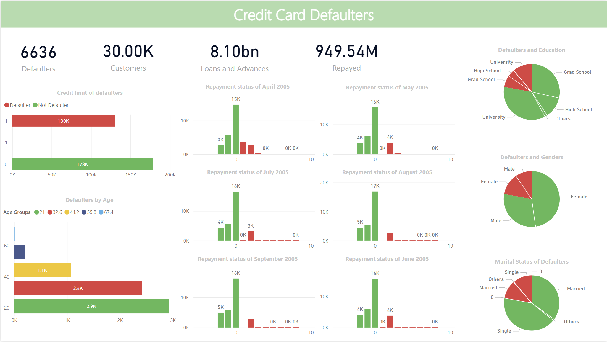

# 💳 Credit Card Defaulters Analysis

[](https://opensource.org/licenses/MIT)
[](https://powerbi.microsoft.com/)
[](Datasets/credit%20card%20data.xlsx)
[]()
[]()
[](https://github.com/pouryare)

A comprehensive Power BI dashboard analyzing credit card default patterns in Taiwan. This interactive visualization tool provides insights into customer payment behaviors, demographic factors affecting defaults, and monthly payment trends.



## 📋 Table of Contents
- [Overview](#overview)
- [Key Features](#key-features)
- [Dashboard Components](#dashboard-components)
- [Dataset Description](#dataset-description)
- [Technical Implementation](#technical-implementation)
- [Installation](#installation)
- [File Structure](#file-structure)
- [Usage](#usage)
- [Key Insights](#key-insights)
- [License](#license)

## 🎯 Overview

The Credit Card Defaulters Analysis Dashboard transforms complex payment data into actionable insights through detailed visualization of default patterns, demographic analysis, and payment behaviors. It enables data-driven decision-making for credit risk assessment and customer profiling.

## ✨ Key Features

- 📊 Default Payment Analysis
- 👥 Demographic Insights
- 💰 Credit Limit Analysis
- 📅 Monthly Payment Tracking
- 📈 Repayment Status Trends
- 🎓 Educational Background Impact
- 💑 Marital Status Correlation

## 📊 Dashboard Components

### 1. Default Statistics
- Total number of defaulters
- Customer count
- Total loans and advances
- Amount repaid

### 2. Demographic Analysis
- Education level distribution
- Gender analysis
- Marital status breakdown
- Age group analysis

### 3. Payment Trends
- Monthly repayment status
- Payment delay patterns
- Credit limit distribution
- Default probability by demographic

## 📚 Dataset Description

The dataset includes comprehensive credit card records with the following key variables:

### 📋 Key Features
- 💰 Credit Amount
- 👤 Demographics (Gender, Education, Marriage, Age)
- 📅 Payment History (6 months)
- 💳 Bill Statements
- 💵 Payment Records

### Variables
- Amount of credit
- Demographic information
- Payment status (April-September 2005)
- Monthly bill statements
- Previous payment amounts

## 🔧 Technical Implementation

### Interactive Features
- Time range filters
- Demographic filters
- Payment status tracking
- Real-time metric updates

### Visualization Types
1. Card visualizations
2. Pie charts
3. Clustered column charts
4. Stacked bar charts
5. Line graphs

## 📥 Installation

```bash
# Clone this repository
git clone https://github.com/pouryare/Credit-Card-Defaulters-Analysis.git
cd Credit-Card-Defaulters-Analysis

# Open the .pbix file
# Connect to your data source
# Refresh the dashboard
```

## 📁 File Structure

```
📦 Credit-Card-Defaulters-Analysis
 ┣ 📂 Datasets
 ┃ ┗ 📄 credit card data.xlsx
 ┣ 📜 .gitattributes
 ┣ 📜 Credit Card Defaulters Analysis.pbix
 ┣ 📜 LICENSE
 ┣ 📜 README.md
 ┗ 📷 screenshot.png
```

## 🚀 Usage

1. Open the .pbix file in Power BI Desktop
2. Navigate through different visualizations
3. Use filters to analyze specific demographics
4. Track payment patterns
5. Monitor default rates

## 🔍 Key Insights

1. **Default Patterns**
   - 6,636 defaulters identified
   - 30,000 total customers analyzed
   - 8.10bn in loans and advances
   - 949.54M repaid amount

2. **Demographic Trends**
   - University graduates show higher default rates
   - Age correlation with default probability
   - Marital status impact on payment behavior

## 📄 License

This project is licensed under the MIT License - see the [LICENSE](LICENSE) file for details.

Made with ❤️ by [Pourya](https://github.com/pouryare)

[](https://github.com/pouryare)